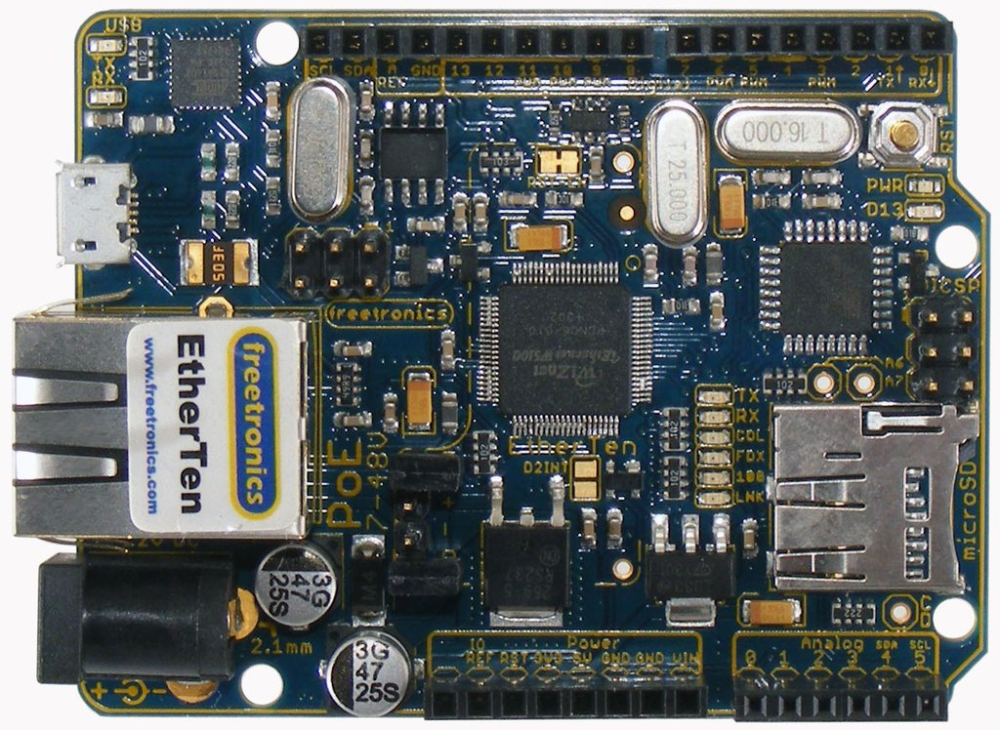
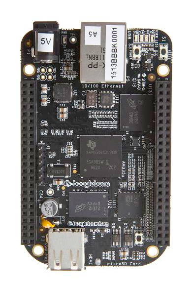
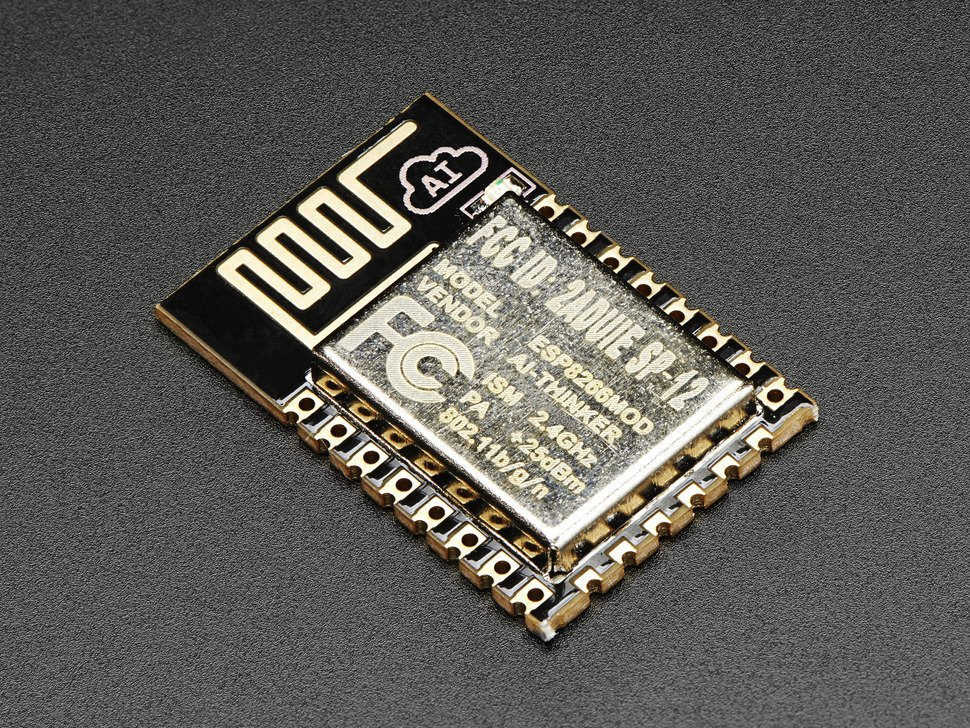
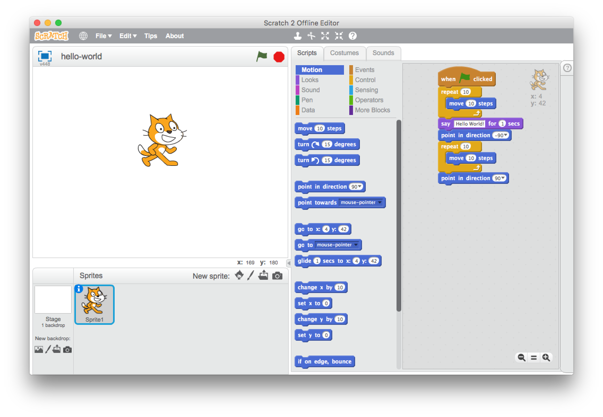
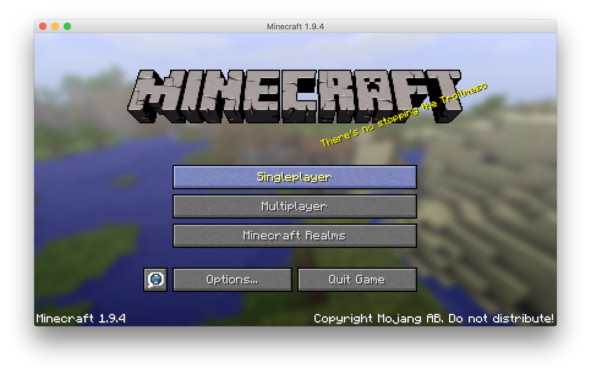
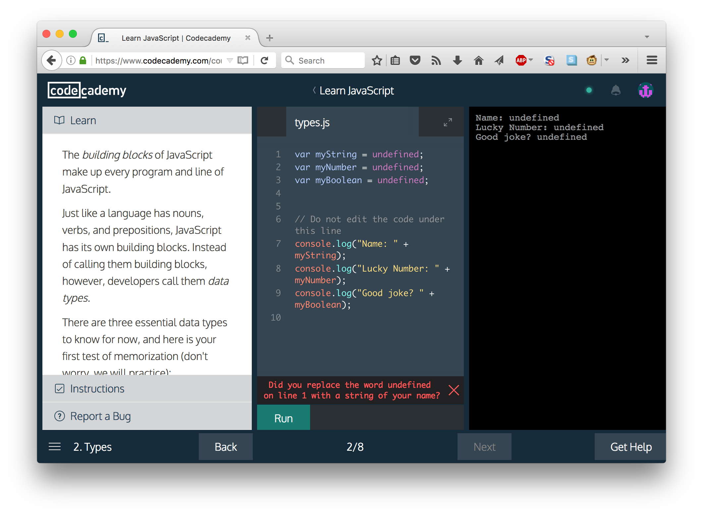
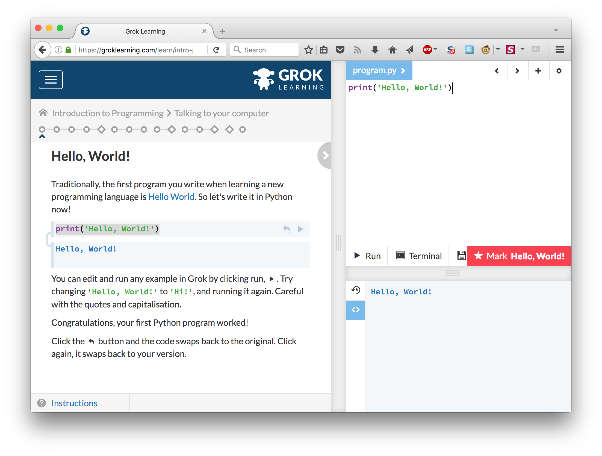
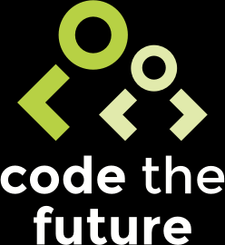
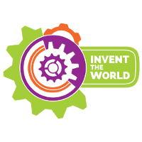

# Preparing to be makers in a consumer-focussed world
### Teaching newbies to hack & develop

Presentation by Matthew Cengia
[@mattcen](http://twitter.com/mattcen)
https://mattcen.github.io/tech-engagement

--
## Who am I
* Linux Systems Adminstrator/Developer
* Scout Leader
* Evangelist and activist
  * Open source and transparency. [Open Knowledge Australia ambassador (au.okfn.org)](http://au.okfn.org)
  * Online privacy and security
  * Diversity

Note:

* Work with youth, teach
* Passionate about teaching openness etc.

--
## Talk outline

* Explain the current state of technology engagement
* Describe issues with this, particularly how we're not exercising technology's full potential
* Propose suggestions on how to fix this

--
## The state of technology engagement

### Where are we now?

Note:

* Everybody using tech (esp. youth) are consumers
* Aside from CS/IT, most don't engage tech's full potential

||
### Phones

* Communication
* Scheduling
* Recording of information
* Games
* Social media
* Other media and entertainment

||
### Tablets

* Communication
* Scheduling
* Recording of information
* Games
* Social media
* Other media and entertainment
* Office productivity

||
### Gaming Consoles

* Gaming
* Social media
* Other media and entertainment

||
### Desktop/Laptop computers

* Most versatile mainstream tech
* Upgradeable
* Hackable
* Easy to tinker with
* But still often only put to previously mentioned uses

--
## The potential of tech

### Where could we be?

||

### Raspberry Pi

Note:

https://raspberrypi.org/

||

### Arduinos

Note:

https://www.arduino.cc/

https://www.freetronics.com.au/collections/arduino/products/etherten

https://www.freetronics.com.au/

||

## BeagleBoard

Note:

https://beagleboard.org/black

||

## BBC Micro:bit

Note:

http://microbit.org/hardware/

||

## ESP8266

Note:

http://esp8266.net/

https://www.adafruit.com/products/2491

||

## Scripting mundane tasks like image editing

    #!/bin/bash

    for image in *.jpg
    do gm mogrify -resize 50% "$image"
    done

--
## Strategies for engagement

### How can we get there?

--

## Gamefication

### Make it easy and fun

||

## Scratch

Note:

* https://scratch.mit.edu/

||

## Minecraft

Note:

https://pi.minecraft.net/

||

## Codecademy

Note:

https://www.codecademy.com/

||

## Grok Learning

Note:

https://groklearning.com/

||

## ICT In Schools

Schools getting better at covering programming etc.

Note:

http://www.scientistsinschools.edu.au/ict/

||

## Code The Future

Note:

http://codefuture.org/

||

## Invent The World

Note:

https://inventtheworld.com.au/

--
## Availability and accessibility

* Cheap hardware
* Free software
* Cheap software
* Cheap subscription services

--

## Resources

Pycon AU Education Seminar

https://www.youtube.com/playlist?list=PLs4CJRBY5F1Jh6fFqT1p5TZRx5q06CcaR

--
## Go hack something!
